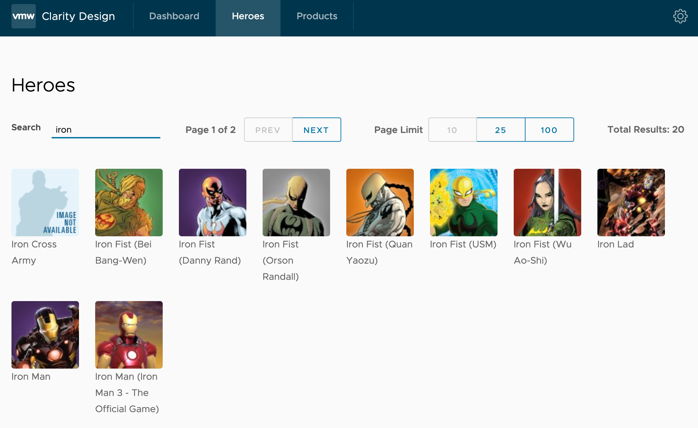

# Reactive Programming Tech Share

This repo is used to share reactive programming skills.

## Todo after cloning this repo

- Get `APIKEY` from [developer.marvel.com](https://developer.marvel.com/)
  - Go to [https://developer.marvel.com/](https://developer.marvel.com/)
  - Create a developer account
  - Add `localhost` to the `Your Authorized Referers` section
  - Add your public and private keys into `apps/rx/.env` file

## How was this repo generated?

1. npx create-nx-workspace@15.6.1
2. repository name: rx; application name: rx
3. add clarity
4. generate tailwind
5. add `@nrwl/express`, and generate api express server
6. generate shared models: `nx generate @nrwl/workspace:library models --skipBabelrc --directory=shared  --no-standaloneConfig --testEnvironment=node --unitTestRunner=none`
7. generate feature lib: `npx nx generate @nrwl/angular:library product --style=scss --directory=feature --changeDetection=OnPush --inlineStyle --lazy --routing --standalone`
